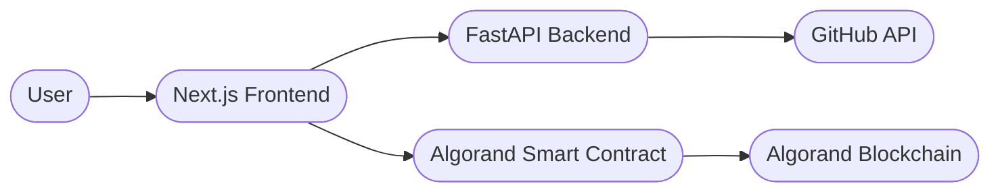

# 🔗 Bounty Escrow Agent

**Eliminate trust issues in open bounty platforms with automated escrow agents. Secure, transparent, and fully on-chain.**

The Bounty Escrow Agent is a decentralized platform that replaces manual payment disputes with an automated, agent-driven verification pipeline. By locking funds in an Algorand smart contract upfront and auto-verifying work via the GitHub API, we create a "Trustless Lifecycle" for digital labor.

---

## 🛠 Tech Stack

[](apps/web/README.md)
[](apps/api/README.md)
[](contracts/README.md)

---

## ✨ Features

- **On-Chain Escrow:** Rewards are locked upfront in a tamper-proof contract.
- **Automated Payouts:** Funds are released the moment the Work Agent verifies the GitHub repository.
- **Zero-Friction UX:** One-click "Verify & Release" simplifies complex blockchain transactions.
- **Micro-History Tracking:** Immutable record of task creation, claiming, and successful completion.
- **Seamless Wallet Integration:** Native support for Pera and Defly wallets.

---

## 📂 Project Structure

```bash
.
├── apps/
│   ├── web/        # Frontend (Next.js 14, Tailwind, TypeScript)
│   └── api/        # Backend (FastAPI, Python, Supabase integration)
├── contracts/      # Smart Contracts (PyTeal, Beaker, Algorand Testnet)
├── README.md       # Root Documentation
└── package.json    # Workspace Definitions
```

---

## 🌍 Real-Life Usage

**The Problem:** Freelance work suffers from "Payment Anxiety" for workers and "Vaporware Risk" for creators.
**The Solution:**
- **Who uses it:** Open-source maintainers, bug-bounty hunters, and micro-freelancers.
- **Why Blockchain:** We use Algorand to ensure transparency and instant finality. Funds are never held by a central company, giving power back to the individuals.
- **The Agent:** Our backend acts as an "Agent" that objectively verifies the work, leaving no room for human bias or manual payout delays.

---

## 🔄 High-Level Flow (How It Works)



1. **Post:** Creator creates a task and funds the Algorand Smart Contract.
2. **Claim:** Worker claims the task and starts working.
3. **Submit:** Worker submits a GitHub repo URL.
4. **Verify:** Backend agent checks the repo and repository metadata.
5. **Release:** Creator approves, and the contract instantly releases funds to the worker.

---

## 🚀 Getting Started

Quickly clone and set up the development environment:

```bash
# 1. Clone the repo
git clone https://github.com/your-repo/bounty-escrow-agent

# 2. Setup Backend & Smart Contracts
cd contracts && pip install -r requirements.txt
cd ../apps/api && pip install -r requirements.txt

# 3. Setup Frontend
cd ../web && npm install
```

---

## 🤝 Contributors

Optimized and built for the **Algorand Hackathon 2026**.
