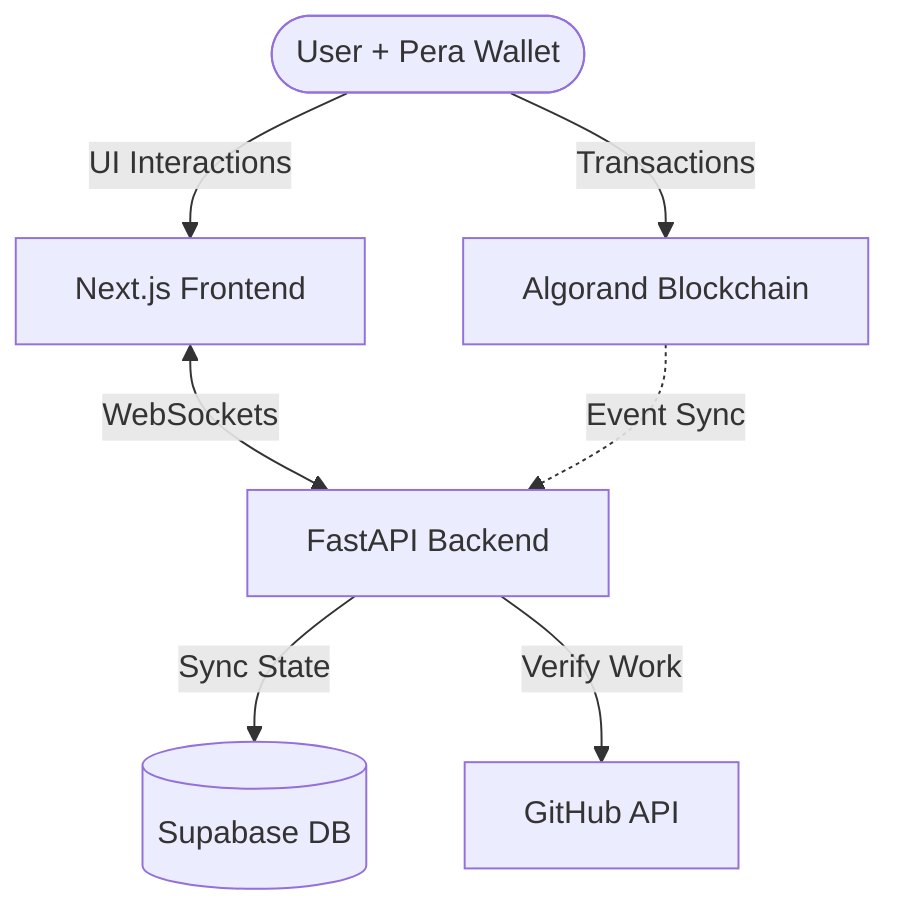

# 🔗 Bounty Escrow Agent: Trustless Task Lifecycle

**Eliminate trust issues in open bounty platforms with automated escrow agents. Secure, transparent, and fully on-chain.**

The Bounty Escrow Agent is a decentralized platform that replaces manual payment disputes with an automated, agent-driven verification pipeline. By locking funds in an Algorand smart contract upfront and using real-time WebSockets to sync state, we create a "Trustless Lifecycle" for digital labor across our high-performance web and mobile-integrated ecosystem.

---

## 🛠 Tech Stack

**Click any badge below to explore detailed documentation for each module**

[](https://algo-bounty.vercel.app)
[](apps/web/README.md)
[](apps/api/README.md)
[](contracts/README.md)
[](https://supabase.com)

---

## ✨ Key Features

- **🛡️ On-Chain Trustless Escrow:** Rewards are locked in an **Algorand Smart Contract** at task creation. No central authority holds the funds.
- **⚡ Real-Time Synchronization:** Integrated **WebSockets** ensure that when a task is funded, claimed, or paid, the live website updates instantly for every user.
- **🤖 Automated Verification:** The backend agent validates work (GitHub repos) objectively before enabling the final payment release.
- **📱 Pera Wallet First:** Seamlessly sign transactions from your smartphone via the **Pera Wallet App**.
- **💎 Premium UX:** A glassmorphic dark-theme dashboard designed for professional reliability on both desktop and mobile views.
- **📊 Micro-History Tracking:** Fully indexed audit logs for every state change in a task's life.

---

## 🔄 The Trustless Workflow

1.  **POST & FUND:** A Creator posts a task. They must fund the task by sending ALGO to the **Smart Contract** via **Pera Wallet**. 
2.  **CLAIM:** A Worker finds an active task and "Claims" it. This locks their address as the official working partner on the blockchain.
3.  **SUBMIT:** Once the work is complete, the Worker submits their GitHub repository URL.
4.  **VERIFY & RELEASE:** The Creator triggers the "Verify" agent. If the GitHub check passes, the Creator signs the release transaction, and the Smart Contract instantly pays the Worker.

---

## 🚀 Getting Started

### **1. Use the Live Website (Easiest)**
No local installation is required to start earning or posting bounties:
- **Visit:** [algo-bounty.vercel.app](https://algo-bounty.vercel.app)
- **Mobile Setup:** Download the **Pera Algo Wallet App** on your phone.
- **Testnet Mode:** Switch Pera Wallet to **Testnet** (found in Developer Settings).
- **Faucet:** Get free Testnet ALGO from the [Algorand Faucet](https://bank.testnet.algorand.network/).

### **2. Local Development Setup**
If you wish to contribute or run your own instance:

**Prerequisites:**
- Node.js 18+ & Python 3.10+
- A Supabase project and a GitHub PAT.

**Backend Setup (`apps/api`):**
```bash
cd apps/api
pip install -r requirements.txt
# Create .env with DATABASE_URL, JWT_SECRET, and GITHUB_TOKEN
uvicorn app.main:app --reload
```

**Frontend Setup (`apps/web`):**
```bash
cd apps/web
npm install --legacy-peer-deps
# Create .env.local with NEXT_PUBLIC_API_URL and NEXT_PUBLIC_ESCROW_APP_ID
npm run dev
```

---

## 📂 Project Repository Structure

```bash
.
├── apps/
│   ├── web/        # Frontend (Next.js 14 Dashboard, Auth, Pera Integration)
│   └── api/        # Backend (FastAPI, Real-time WebSockets, Validation Agent)
├── contracts/      # Smart Contracts (PyTeal Escrow Code, Deployment Scripts)
├── README.md       # Root Documentation
└── package.json    # Workspace Definitions
```

---

## 🏗 Architecture Overview

The system follows a reactive architecture where the blockchain acts as the source of financial truth, while the backend agent handles real-time synchronization and Web2 validation.



---

